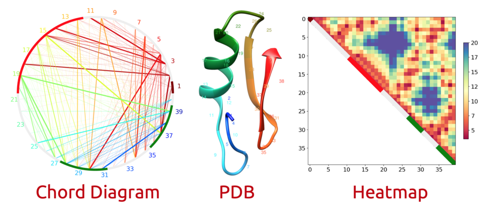

# DISTEVAL: For evaluating protein inter-residue distances
Protein inter-residue contact and distance prediction is a key intermediate step towards accurate protein structure prediction. Distance prediction comes in two forms: real-valued distances and 'binned' distograms, a more finely grained variant of the binary contact prediction problem. Importantly, the later has been introduced as a new challenge in the 14th Critical Assessment of Techniques for Protein Structure Prediction (2020) experiment. Despite the recent proliferation of methods for predicting distances, few methods exist for evaluating these predictions.  Currently only numerical metrics, which evaluate the entire prediction at once, are used.  These give no insight into the structural details of a prediction and, as such, new methods and tools are needed. We have developed a web-server for evaluating predicted inter-residue distances. Our server, DISTEVAL, accepts predicted contacts, distances, and true structure as optional inputs to generate informative heatmaps, chord diagrams, and 3D models which facilitate visual and qualitative assessment. The server also evaluates predictions using mean absolute error (MAE) and the standard 'contact precision' metric. DISTEVAL will be useful for researchers in the field of protein structure prediction. The visualizations generated complement each other and collectively serve as a powerful tool for both quantitative and qualitative assessments of predicted contacts and distances, even in the absence of a true 3D structure.

**Webserver:** [http://deep.cs.umsl.edu/disteval/](http://deep.cs.umsl.edu/disteval/)

<p align="center">

</p>

# Prerequisites (for the downloadable version)

## Prerequisites for distance and contact evaluation
- [x] Python3
- [x] Numpy
- [x] Scikit-learn

## Prerequisites for building 3D models
- [x] Install csh
   ```
   sudo apt install csh
   ```
- [x] Download 'dssp-2.0.4-linux-amd64' from https://osf.io/qydjv/
   ```
   chmod +x dssp-2.0.4-linux-amd64
   ```
- [x] Download TM-score from https://zhanglab.ccmb.med.umich.edu/TM-score/
    ```
    gunzip TM-score.gz
    chmod +x TM-score
    ```
- [x] CONFOLD
    - Follow instructions [here](CONFOLD-CHANGES.md) to download, install, and modify CONFOLD

# Test

## Test distance and contact evaluation

Download all the files in the test folder, for example:
   ```
   wget https://raw.githubusercontent.com/ba-lab/disteval/main/test/1guuA.contact.rr
   ```

### Example 0. See help
   ```
   python3 ../disteval-using-confold.py -h
   ```

### Example 1. Evaluate a predicted RR contacts file
   ```
   python3 ../disteval-using-confold.py -n 1guuA.pdb -c 1guuA.contact.rr
   ```
   Expected output:
   ```
   Evaluating contacts..
   sep: 12 xL: Top-L/5 {'precision': 1.0, 'count': 9}
   sep: 12 xL: Top-L   {'precision': 1.0, 'count': 9}
   sep: 12 xL: Top-NC  {'precision': 1.0, 'count': 9}
   sep: 24 xL: Top-L/5 {'precision': 1.0, 'count': 1}
   sep: 24 xL: Top-L   {'precision': 1.0, 'count': 1}
   sep: 24 xL: Top-NC  {'precision': 1.0, 'count': 1}
   ```
### Example 2. Evaluate a predicted distance map
   ```
   python3 ../disteval-using-confold.py -n 1guuA.pdb -d 1guuA.predicted.npy
   ```
   Expected output:
   ```
   Evaluating distances..
   sep: 12 xL: Top-L/5 {'mae': 0.9403, 'mse': 1.5143, 'rmse': 1.2306, 'count': 10}
   sep: 12 xL: Top-L   {'mae': 1.7522, 'mse': 5.6841, 'rmse': 2.3841, 'count': 50}
   sep: 12 xL: Top-NC  {'mae': 1.9263, 'mse': 6.6872, 'rmse': 2.586, 'count': 603}
   sep: 24 xL: Top-L/5 {'mae': 1.8154, 'mse': 4.6469, 'rmse': 2.1557, 'count': 10}
   sep: 24 xL: Top-L   {'mae': 2.1541, 'mse': 8.1816, 'rmse': 2.8603, 'count': 50}
   sep: 24 xL: Top-NC  {'mae': 2.4536, 'mse': 9.6231, 'rmse': 3.1021, 'count': 295}

   Evaluating contacts..
   sep: 12 xL: Top-L/5 {'precision': 0.9, 'count': 10}
   sep: 12 xL: Top-L   {'precision': 0.6, 'count': 30}
   sep: 12 xL: Top-NC  {'precision': 0.6, 'count': 30}
   sep: 24 xL: Top-L/5 {'precision': 0.5, 'count': 10}
   sep: 24 xL: Top-L   {'precision': 0.38462, 'count': 13}
   sep: 24 xL: Top-NC  {'precision': 0.38462, 'count': 13}
   ```
### Example 3. Evaluate trRosetta prediction
   ```
   python3 ../disteval-using-confold.py -n 1guuA.pdb -r 1guuA.npz 
   ```
   Expected output:
   ```
   Evaluating distances..
   sep: 12 xL: Top-L/5 {'mae': 0.5485, 'mse': 0.5375, 'rmse': 0.7331, 'count': 10}
   sep: 12 xL: Top-L   {'mae': 0.6789, 'mse': 0.7678, 'rmse': 0.8762, 'count': 50}
   sep: 12 xL: Top-NC  {'mae': 1.2951, 'mse': 3.8733, 'rmse': 1.9681, 'count': 741}
   sep: 24 xL: Top-L/5 {'mae': 0.537, 'mse': 0.4237, 'rmse': 0.6509, 'count': 10}
   sep: 24 xL: Top-L   {'mae': 0.6691, 'mse': 0.6725, 'rmse': 0.8201, 'count': 50}
   sep: 24 xL: Top-NC  {'mae': 1.2281, 'mse': 3.2863, 'rmse': 1.8128, 'count': 351}

   Evaluating contacts..
   sep: 12 xL: Top-L/5 {'precision': 1.0, 'count': 10}
   sep: 12 xL: Top-L   {'precision': 0.8, 'count': 30}
   sep: 12 xL: Top-NC  {'precision': 0.8, 'count': 30}
   sep: 24 xL: Top-L/5 {'precision': 1.0, 'count': 10}
   sep: 24 xL: Top-L   {'precision': 0.84615, 'count': 13}
   sep: 24 xL: Top-NC  {'precision': 0.84615, 'count': 13}
   ```

## Test distance/contact-guided model building)
1. predicted contacts + SS
1. predicted distances with high seq sep + SS
1. native dmap
1. very high accuracy native dmap reconstruction
1. predicted 2D numpy
1. trRosetta
1. CASP distances RR


## Contact  
Badri Adhikari  
adhikarib@umsl.edu  
University of Missouri-St. Louis  
